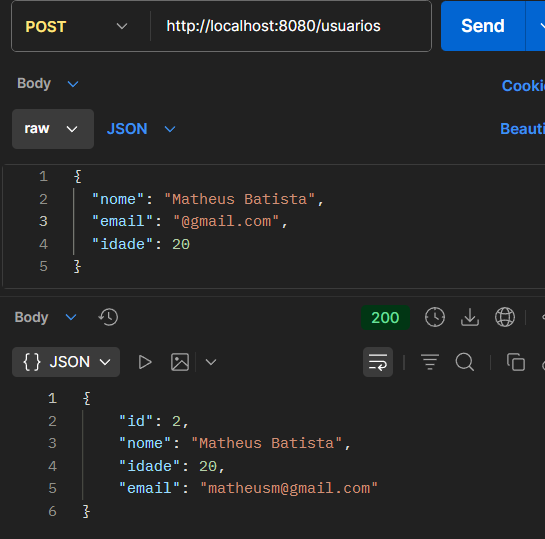
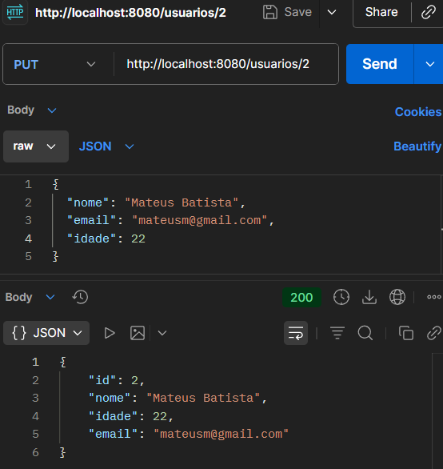
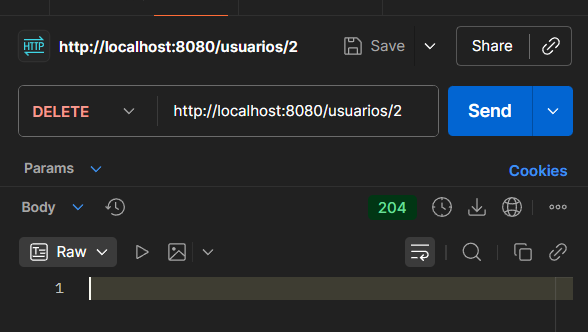

# 📌 API de Usuários – Documentação Completa

## 👩‍💻 Autora

**Giovanna Tomacelli Andrade**

---

## 📘 Introdução

Esta API foi desenvolvida como parte do trabalho proposto em sala, utilizando **Java + Spring Boot** e banco de dados **PostgreSQL**. Ela realiza operações básicas de CRUD (Create, Read, Update, Delete) para gerenciar usuários.

---

## 🚀 Tecnologias Utilizadas

* Java 21
* Spring Boot
* Spring Web
* Spring Data JPA
* PostgreSQL
* Maven
* Postman (para testes)

---

## 🏗️ Arquitetura do Projeto

```
src/main/java
 └── controller
 └── model
 └── repository
 └── ApiUsuariosApplication.java
```

---

## 🛢️ Configuração do Banco de Dados

Crie um banco no PostgreSQL chamado:

```
api_usuarios
```

### application.properties

```properties
spring.datasource.url=jdbc:postgresql://localhost:5432/api_usuarios
spring.datasource.username=postgres
spring.datasource.password=COLOQUE_AQUI_SUA_SENHA

spring.jpa.hibernate.ddl-auto=update
spring.jpa.show-sql=true
spring.jpa.properties.hibernate.format_sql=true
spring.jpa.database-platform=org.hibernate.dialect.PostgreSQLDialect
```

---

## 🔗 Endpoints da API

### 📄 Tabela solicitada no enunciado

| Ação                     | Método | Endpoint         |
| ------------------------ | ------ | ---------------- |
| Buscar todos os usuários | GET    | `/usuarios`      |
| Criar usuário            | POST   | `/usuarios`      |
| Atualizar usuário        | PUT    | `/usuarios/{id}` |
| Deletar usuário          | DELETE | `/usuarios/{id}` |

---

## 📚 Exemplos de Requisições

### ➤ **POST /usuarios**

```json
{
  "nome": "Maria",
  "email": "maria@email.com",
  "idade": 30
}
```

### ➤ **PUT /usuarios/{id}**

```json
{
  "nome": "Maria Silva",
  "email": "maria.silva@email.com",
  "idade": 31
}
```

---

## 🧪 Relatório de Testes (Postman)

A seguir estão os testes obrigatórios solicitados pelo professor.

### ✅ **CT01 – Listar usuários**

* **Método:** GET
* **Endpoint:** `/usuarios`
* **Resultado esperado:** retornar lista de usuários
* **Resultado obtido:** 

---

### ✅ **CT02 – Criar usuário**

* **Método:** POST
* **Endpoint:** `/usuarios`
* **Body:** JSON
* **Resultado esperado:** usuário criado com ID gerado
* **Resultado obtido:** 

---

### ✅ **CT03 – Atualizar usuário**

* **Método:** PUT
* **Endpoint:** `/usuarios/{id}`
* **Body:** JSON
* **Resultado esperado:** dados atualizados
* **Resultado obtido:** 

---

### ✅ **CT04 – Deletar usuário**

* **Método:** DELETE
* **Endpoint:** `/usuarios/{id}`
* **Resultado esperado:** status 204
* **Resultado obtido:** 

---

## 📦 Como Rodar o Projeto

### 1️⃣ Clonar o repositório

```
git clone https://github.com/gitomacelli/Crud_Alunos
```

### 2️⃣ Instalar dependências

```
mvn clean install
```

### 3️⃣ Rodar o projeto

No IntelliJ, clique em **Run** na classe principal.

A API ficará disponível em:

```
http://localhost:8080
```

---

## 📝 Considerações Finais

O trabalho atende todos os requisitos solicitados:

* CRUD completo
* Conexão com banco PostgreSQL
* Testes realizados no Postman
* Relatório e documentação enviados no repositório Git

Tudo funcionando corretamente e validado.

---

✨ *Qualquer observação adicional pode ser acrescentada abaixo.*
